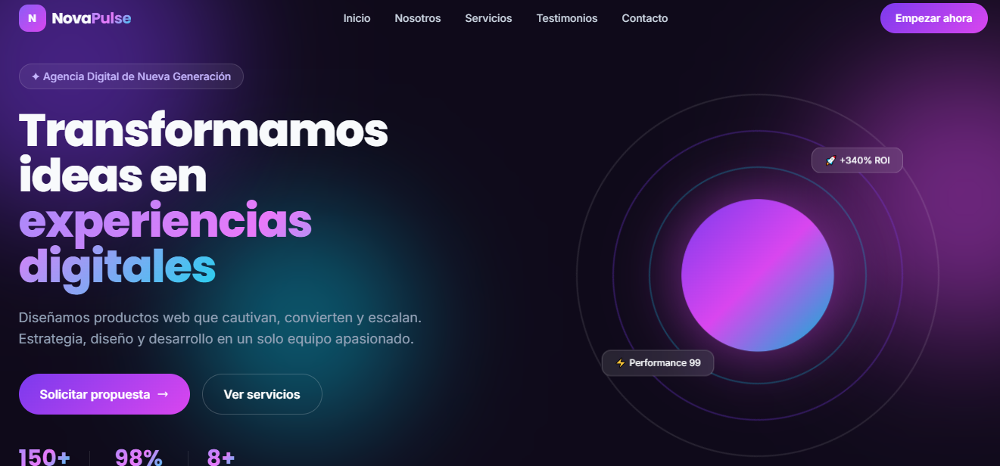

# PFO2: Evaluación de Agentes de IA en el Desarrollo Frontend

## Checklist de Entrega
- [x] Datos del estudiante completados.
- [x] Link al repositorio Github.
- [x] Link al deploy unificado de Vercel añadido.
- [x] Prompt maestro utilizado incluido.
- [x] Comparativa de resultados.
- [x] Capturas de pantalla de ambos sitios web añadidas.
- [x] Respetada la metodología de no modificar manualmente el código.
- [x] Estructura del repositorio

## Datos del Estudiante
- **Nombre:** Gabriela Gonzalez
- **Materia:** Desarrollo de Sistemas Web (Front End)
- **Comisión** D (Lunes)
- **Institución:** IFTS N.°29
- **Fecha de entrega:** 24/06/2026

## Acceso al Proyecto
- **Repositorio GitHub:** [https://github.com/melinya-byte/pfo2-evaluacion-ia](https://github.com/melinya-byte/pfo2-evaluacion-ia)
- **Deploy Unificado (Vercel):** [https://pfo2-evaluacion-ia.vercel.app/](https://pfo2-evaluacion-ia.vercel.app/)

## Prompt Maestro Utilizado
```
# Role
Actúa como un Ingeniero Senior de Frontend especializado en UI/UX con dominio en tecnologías modernas (HTML5, Tailwind CSS y JavaScript moderno). Tu objetivo es desarrollar una Landing Page de alta conversión, estética, moderna y totalmente responsiva.

# Contexto del Proyecto
Debes generar una estructura web completa que cumpla con los estándares de diseño actuales: diseño limpio, tipografía legible, uso estratégico de espacios en blanco y una paleta de colores vibrante pero profesional.

# Especificaciones Técnicas
1. Stack: HTML5 y Tailwind CSS (vía CDN para facilitar el despliegue).
2. Responsividad: Mobile-first. Debe verse impecable en móviles, tablets y escritorios.
3. Estilos:
   - Usa una paleta de colores vibrante pero coherente (ej: gradientes sutiles, sombras suaves "glassmorphism" en elementos clave).
   - Implementa transiciones suaves (hover effects) en botones y enlaces.
   - Tipografía sans-serif moderna (tipo Inter o Poppins).

# Estructura Requerida (Landing Page)
Debes implementar las siguientes secciones de forma jerárquica:
1. Header: Menú de navegación sticky con logo a la izquierda y enlaces a la derecha (Mobile menu toggle necesario).
2. Hero Section: Título impactante (H1), subtítulo descriptivo, botón de CTA con gradiente y una imagen de fondo o elemento visual dinámico.
3. Sobre Nosotros: Descripción breve, enfocada en valor al cliente.
4. Servicios: Grid de 3 tarjetas (card) con iconos y descripciones.
5. Testimonios: Carrusel o grid de 3 tarjetas con diseño limpio.
6. Formulario de Contacto: Maquetado visual profesional (inputs con bordes redondeados, label claro).
7. Footer: Links a redes sociales, copyright y links legales básicos.

# Reglas de Ejecución (Restricciones)
- NO modifiques código manualmente: debes entregar una solución completa y funcional en la primera iteración.
- Asegura que el código sea semántico y optimizado.
- No incluyas scripts pesados; usa CSS para las animaciones donde sea posible.

# Resultado Esperado
Genera el código en un único archivo HTML que contenga el CSS necesario en un tag <style> y los scripts en <script>.
```

## Prompt maestro optimizado para Cursor (por comportamiento recursivo en Cursor)
```
# Role
Actúa como un Ingeniero Senior de Frontend. Tu tarea es generar una Landing Page profesional, estética y responsiva, siguiendo las mejores prácticas de UI/UX.

# Contexto y Estructura
Crea una Landing Page completa utilizando un único archivo HTML. Todo el CSS debe estar contenido en etiquetas <style> y toda la lógica JS necesaria en etiquetas <script>. 
Estructura obligatoria:
1. Header (con menú navegación sticky).
2. Hero Section (H1, CTA, visual dinámico).
3. Sobre Nosotros.
4. Servicios (Grid de 3 tarjetas).
5. Testimonios (Grid de 3 tarjetas).
6. Formulario de contacto (Solo maquetado).
7. Footer (Redes sociales y legal).

# Especificaciones Técnicas
- Stack: HTML5 + Tailwind CSS (vía CDN oficial de Tailwind).
- Responsividad: Mobile-first.
- Diseño: Usa paleta vibrante, efectos de glassmorphism y transiciones hover suaves.
- Tipografía: Sans-serif moderna (Inter/Poppins).

# REGLAS DE EJECUCIÓN (CRÍTICO)
1. NO inicies procesos de auto-iteración ni mejora continua tras la primera generación.
2. Genera el código completo en UNA SOLA RESPUESTA.
3. Si el código es extenso, no te detengas; escribe la totalidad del archivo de principio a fin.
4. NO modifiques, corrijas ni re-escribas el código una vez generado.
5. OBJETIVO: Entregar un archivo funcional, limpio y listo para implementar. 
6. DETENTE inmediatamente al terminar la etiqueta </html>.
```

## Comparativa de Resultados

### 1. Landing Page - Codex
- **Archivo:** `/indexcodex.html`
- **Observaciones:** El código fue generado de forma directa en una única iteración. Codex demostró una excelente capacidad para interpretar las especificaciones de diseño, integrando correctamente Tailwind CSS vía CDN, implementando efectos visuales avanzados como glassmorphism y animaciones personalizadas, todo manteniendo una estructura HTML semántica y una arquitectura responsiva altamente funcional.
- **Captura:** 

### 2. Landing Page - Cursor
- **Archivo:** `/indexcursor.html`
- **Observaciones:** La landing page generada a través de Cursor destaca por un nivel de sofisticación visual superior, ofreciendo una experiencia muy pulida. El diseño integra de forma adecuada elementos complejos como animaciones de esferas flotantes, efectos de glassmorphism y transiciones suaves que elevan la percepción de calidad del producto final, tal como se aprecia en la imagen cursorweb.

Desafíos en el proceso de desarrollo:
Durante la implementación, el prompt maestro generó inicialmente un comportamiento recursivo (loop) que impedía la correcta renderización de algunos componentes. Este inconveniente se resolvió mediante una optimización iterativa del prompt, ajustando las instrucciones para definir límites claros en la estructura del código y los alcances del diseño. Una vez superado este ajuste, el resultado final fue altamente satisfactorio, logrando una arquitectura sólida, responsiva y estéticamente profesional que supera mis expectativas iniciales en relación a Cursor, el que me dio problemas desde su instalación hasta el comportamiento recursivo.
- **Captura:** 

## Metodología
Se ha respetado estrictamente la restricción de **no modificar el código generado manualmente**, evaluando la capacidad de resolución autónoma de cada agente bajo los requisitos mínimos solicitados: Cabecera, Hero Section, Sobre Nosotros, Servicios, Testimonios, Formulario de contacto y Footer.

## Estructura del Repositorio
- `index.html`: Portada principal con acceso a las landing pages.
- `Agente1/indexcodex.html`: Landing page generada por Codex.
- `Agente2/indexcursor.html`: Landing page generada por Cursor.
- `codexweb.png`: Captura de pantalla de la landing de Codex.
- `cursorweb.png`: Captura de pantalla de la landing de Cursor.
- `prompt.txt`: Prompt utilizado para la generación.
- `README.md`: Documentación del proyecto.
